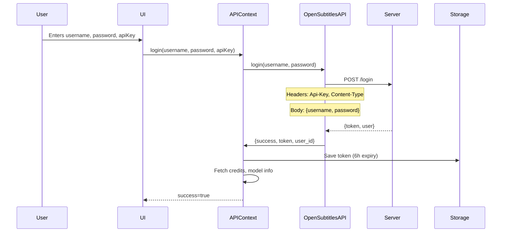

# Authentication

## Overview

Authentication is required for all AI service operations. The system uses JWT token-based authentication with API key identification.

## Components

- **API Key**: Identifies the client application (required for all requests)
- **JWT Token**: Bearer token for user authentication (6-hour validity)
- **User Credentials**: Username and password (used only during login)

## Login Flow

### Step-by-Step



### Implementation

**Endpoint**: `POST {baseURL}/login`

**Request**:
```typescript
Headers:
  Accept: application/json
  Api-Key: "your-api-key"
  User-Agent: "aios v1"
  X-User-Agent: "aios v1"
  Content-Type: application/json

Body:
  {
    "username": "user@example.com",
    "password": "secretpassword"
  }
```

**Success Response (200)**:
```typescript
{
  "token": "eyJhbGciOiJIUzI1NiIsInR5cCI6IkpXVCJ9...",
  "user": {
    "user_id": 12345
  }
}
```

**Error Responses**:
```typescript
// 401 Unauthorized
{
  "error": "Invalid username or password"
}

// 429 Too Many Requests
{
  "error": "Too many login attempts. Please wait."
}

// Custom "blocked" response
{
  "error": "Account temporarily blocked by the API"
}
```

### Code: OpenSubtitlesAPI.login()

```typescript
async login(username: string, password: string) {
  // Single attempt - NO RETRY
  if (!username || !password) {
    return { success: false, error: 'Username and password required' };
  }
  if (!this.apiKey) {
    return { success: false, error: 'API Key required' };
  }

  const response = await fetch(this.getLoginUrl('/login'), {
    method: 'POST',
    headers: this.getHeaders(false, 'application/json'),
    body: JSON.stringify({ username, password }),
  });

  if (!response.ok) {
    // Handle error with user-friendly messages
    const errorText = await response.text();
    let errorMessage = `HTTP ${response.status}: ${response.statusText}`;
    
    try {
      const parsed = JSON.parse(errorText);
      errorMessage = parsed.error || parsed.message || errorMessage;
    } catch {
      if (errorText) errorMessage = errorText;
    }

    // Special cases
    if (errorMessage.toLowerCase() === 'blocked') {
      errorMessage = 'Account temporarily blocked';
    } else if (response.status === 401) {
      errorMessage = 'Invalid username or password';
    } else if (response.status === 429) {
      errorMessage = 'Too many login attempts';
    }

    return { success: false, error: errorMessage };
  }

  const data = await response.json();
  if (data.token) {
    this.token = data.token;
    this.saveToken(this.token);  // Cache with 6h expiry
    return { 
      success: true, 
      token: this.token, 
      user_id: data.user?.user_id 
    };
  }
  
  return { success: false, error: 'No token received' };
}
```

## Token Management

### Storage

Tokens are stored in `localStorage` with expiry tracking:

```typescript
// Key names
const TOKEN_KEY = 'ai_opensubtitles_token';
const TOKEN_EXPIRY_KEY = 'ai_opensubtitles_token_expiry';
const TOKEN_VALIDITY_HOURS = 6;

// Saving
localStorage.setItem(TOKEN_KEY, token);
localStorage.setItem(TOKEN_EXPIRY_KEY, 
  String(Date.now() + 6 * 3600 * 1000));

// Retrieval with validation
function getValidToken(): string | null {
  const token = localStorage.getItem(TOKEN_KEY);
  const expiry = localStorage.getItem(TOKEN_EXPIRY_KEY);
  
  if (!token || !expiry) return null;
  if (Date.now() > parseInt(expiry)) {
    clearToken();  // Auto-cleanup expired
    return null;
  }
  return token;
}
```

### Usage in Requests

```typescript
private getHeaders(includeAuth: boolean = true) {
  const headers: Record<string, string> = {
    'Accept': 'application/json',
    'Api-Key': this.apiKey || '',
    'User-Agent': getUserAgent(),
    'X-User-Agent': getUserAgent(),
  };
  
  if (includeAuth && this.token) {
    headers['Authorization'] = `Bearer ${this.token}`;
  }
  
  return headers;
}
```

**Note**: `/login` endpoint does NOT include `Authorization` header.

## Auto-Login

### Purpose

Restore user session on page reload without requiring manual login.

### Implementation

```typescript
const autoLogin = async (): Promise<boolean> => {
  // Prevent double-fire (React StrictMode)
  if (authAttemptedRef.current) return false;
  authAttemptedRef.current = true;

  const cfg = storageService.getConfig();
  
  // Need all three for auto-login
  if (!cfg.apiKey || !cfg.username || !cfg.password) {
    return false;
  }

  // Try cached token first
  const hasCached = await api.loadCachedToken();
  if (hasCached) {
    // Verify token is still valid
    const credits = await api.getCredits();
    if (credits.success) {
      setIsAuthenticated(true);
      await loadAPIInfo(api);  // Load models, languages
      return true;
    }
    // Token invalid - clear it
    await api.clearCachedToken();
  }

  // IMPORTANT: Only auto-login if we have cached token
  // Prevents 429 rate limit from automatic /login calls
  if (!hasCached) {
    return false;  // User must login manually
  }

  // Fresh login with stored credentials
  const result = await api.login(cfg.username, cfg.password);
  if (result.success) {
    setIsAuthenticated(true);
    await loadAPIInfo(api);
    return true;
  }
  
  return false;
};
```

### Key Design Decision

**No automatic `/login` on page load** if token is missing/expired.

Rationale:
- Prevents rate limit bans (429 errors)
- Users may have multiple tabs open
- Reduces unnecessary server load
- Better UX: explicit login action

### When Auto-Login Works

✅ Cached token is valid  
✅ Token passes `getCredits()` verification  

❌ Cached token expired → Manual login required  
❌ No stored credentials → Manual login required  
❌ Token invalid → Manual login required  

## Session Expiration Handling

### Detection

API responses with `401 Unauthorized` or `403 Forbidden` indicate expired/invalid sessions.

### Response Flow

```typescript
const withAuthRetry = async <T>(fn: () => Promise<T>): Promise<T> => {
  try {
    return await fn();
  } catch (err: any) {
    const status = err.status || 0;
    
    if ((status === 401 || status === 403) && !sessionExpiredRef.current) {
      // Mark session as expired
      sessionExpiredRef.current = true;
      
      // Clear token
      await api.clearCachedToken();
      
      // Check for stored credentials
      const cfg = storageService.getConfig();
      if (cfg.username && cfg.password && cfg.apiKey) {
        // Show reconnect prompt (stay on page)
        setError('Session expired. Click Reconnect to continue.');
        setSessionExpired(true);
      } else {
        // No stored creds - redirect to login
        setIsAuthenticated(false);
        setError('Session expired. Please log in again.');
      }
    }
    
    throw err;
  }
};
```

### User Experience

**With Stored Credentials** ("Remember Me" was checked):
```tsx
{sessionExpired && (
  <div className="session-expired">
    <p>Your session has expired.</p>
    <button onClick={reconnect}>Reconnect</button>
  </div>
)}
```

**Without Stored Credentials**:
- Automatic redirect to login page
- Message: "Session expired. Please log in again."

## Reconnection Flow

Purpose: Fresh login using stored credentials without page reload.

```typescript
const reconnect = async (): Promise<boolean> => {
  const cfg = storageService.getConfig();
  
  if (!cfg.username || !cfg.password || !cfg.apiKey) {
    setError('No stored credentials. Please log in again.');
    return false;
  }

  setIsAuthenticating(true);
  
  try {
    // FRESH login - not using cached token
    const result = await api.login(cfg.username, cfg.password);
    
    if (result.success) {
      sessionExpiredRef.current = false;
      setSessionExpired(false);
      setError(null);
      setIsAuthenticated(true);
      
      // Refresh credits and model info
      await api.getCredits();
      await loadAPIInfo(api);
      
      logger.info('APIContext', 'Reconnected successfully');
      return true;
    }
    
    setError(result.error || 'Reconnection failed');
    return false;
  } catch (err) {
    setError(err.message || 'Reconnection failed');
    return false;
  } finally {
    setIsAuthenticating(false);
  }
};
```

## Logout

Complete cleanup of authentication state:

```typescript
const logout = () => {
  // Clear API token
  api.clearCachedToken();
  
  // Clear all API caches
  api.clearCache();
  
  // Clear user-specific cache
  CacheManager.clearUser();
  
  // Remove stored credentials
  storageService.clearCredentials();
  storageService.setRememberMe(false);
  
  // Reset state
  setIsAuthenticated(false);
  sessionExpiredRef.current = false;
  setSessionExpired(false);
  setCredits(null);
  setTranscriptionInfo(null);
  setTranslationInfo(null);
  setError(null);
  authAttemptedRef.current = false;
  
  logger.info('APIContext', 'Logged out');
};
```

## Security Considerations

### 1. Token Storage
- Stored in `localStorage` (vulnerable to XSS)
- 6-hour expiry limits exposure
- Alternative: Consider httpOnly cookies for production (requires backend changes)

### 2. Credential Storage
- Username/password only stored if "Remember Me" is checked
- API key always stored (needed for all requests)
- Encryption: None (consider encryption for production)

### 3. HTTPS
- All production requests use HTTPS
- Development uses Vite proxy (avoids CORS issues)

### 4. Token Transmission
- Sent via `Authorization: Bearer <token>` header
- Not included in URL (prevents logging)
- Excluded from `/login` request (circular dependency)

### 5. Rate Limiting
- Login endpoint: No retry (prevents brute force)
- Other endpoints: 3 retries with exponential backoff
- 429 responses handled gracefully

## Common Scenarios

### First Visit
```
1. User opens app
2. autoLogin() checks for stored credentials
3. No credentials found → Show login form
4. User enters username, password, apiKey
5. POST /login → Receive token
6. Token cached, user authenticated
7. Load credits, transcription/translation info
```

### Page Reload ("Remember Me" checked)
```
1. User reloads page
2. autoLogin() finds stored credentials
3. Cached token exists → Validate with getCredits()
4. Token valid → User stays authenticated
5. No login form shown
```

### Page Reload (No "Remember Me")
```
1. User reloads page
2. autoLogin() finds no stored password
3. No cached token → Show login form
4. User must log in again
```

### Session Expiration (6 hours)
```
1. User makes API request after 6 hours
2. Server returns 401 Unauthorized
3. withAuthRetry detects 401
4. Token cleared from storage
5. If credentials stored → Show "Reconnect" button
6. If no credentials → Redirect to login
```

### Network Timeout
```
1. Request fails (offline or timeout)
2. networkUtils categorizes error
3. If retryable → Retry with backoff (3 attempts)
4. If not retryable → Show error to user
```

## API Reference

### OpenSubtitlesAPI Methods

#### Authentication
- `login(username, password)` → `{success, token, user_id, error}`
- `loadCachedToken()` → `boolean`
- `clearCachedToken()` → `void`

#### Token Management
- `setApiKey(key)` → `void`
- `getHeaders(includeAuth)` → `Record<string, string>`

### APIContext Methods

#### Auth Operations
- `login(username, password, apiKey, rememberMe)` → `Promise<boolean>`
- `logout()` → `void`
- `autoLogin()` → `Promise<boolean>`
- `reconnect()` → `Promise<boolean>`

#### State
- `isAuthenticated: boolean`
- `isAuthenticating: boolean`
- `sessionExpired: boolean`

## Troubleshooting

### Login Always Fails (401)

**Causes**:
- Incorrect username/password
- Account doesn't exist
- API key not configured

**Solutions**:
- Verify credentials at ai.opensubtitles.com
- Check API key in account settings
- Ensure using opensubtitles.com (not .org) account

### "Too Many Login Attempts" (429)

**Cause**: Rapid login attempts trigger rate limiting

**Solutions**:
- Wait 60 seconds before trying again
- Check stored credentials for auto-login
- Don't refresh page repeatedly

### Session Expires Immediately

**Causes**:
- Clock skew between client/server
- Token tampering
- Server-side session invalidation

**Solutions**:
- Check system time is accurate
- Re-authenticate
- Contact support if persistent

### Auto-Login Not Working

**Check**:
- "Remember Me" was checked during login
- localStorage is not disabled
- Credentials stored in config (check DevTools)
- No private browsing mode

## Related Files

- `src/services/api.ts` - Core API implementation (887 lines)
- `src/contexts/APIContext.tsx` - Auth state management (533 lines)
- `src/utils/networkUtils.ts` - Retry/error handling (288 lines)
- `src/services/storageService.ts` - Token/credential storage (120 lines)
- `src/services/cache.ts` - Response caching