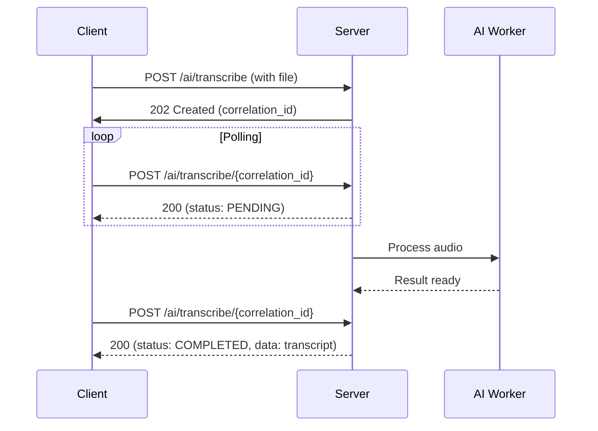

# Transcription Services

Transcription converts audio/video content to text subtitles using AI models.

## Overview

The transcription workflow involves:
1. Language/model selection
2. File upload
3. Asynchronous processing
4. Status polling
5. Result retrieval

## Available Models

Retrieved via `getTranscriptionInfo()`:
- OpenAI Whisper (various sizes)
- Google Speech-to-Text
- Azure Speech Services
- And other AI providers

Each model supports different languages and has varying accuracy/speed trade-offs.

## Key Types

```typescript
interface TranscriptionOptions {
  language: string;     // Target language code (e.g., "en", "es-ES")
  api: string;          // Model name (e.g., "openai-whisper-large-v3")
  returnContent?: boolean;  // Include transcript in response
}

interface APIResponse<T = any> {
  correlation_id?: string;  // Track async operation
  status: 'CREATED' | 'PENDING' | 'COMPLETED' | 'ERROR' | 'TIMEOUT';
  data?: T;
  errors?: string[];
}

interface CompletedTaskData {
  file_name: string;
  url: string;              // Download URL for transcript
  character_count: number;
  unit_price: number;
  total_price: number;
  credits_left: number;
  task: {
    login: string;
    loginid: string;
    id: string;
    api: string;
    language: string;
    start_time: number;
  };
}
```

## Methods

### getTranscriptionInfo()

Retrieves available transcription models and supported languages.

**Endpoint**: `POST /ai/info/transcription_apis` and `/ai/info/transcription_languages`

**Implementation**:
```typescript
async getTranscriptionInfo(): Promise<{
  success: boolean;
  data?: TranscriptionInfo;
  error?: string;
}>

interface TranscriptionInfo {
  apis: { [apiName: string]: any };
  languages: { [apiName: string]: LanguageInfo[] } | LanguageInfo[];
}

interface LanguageInfo {
  language_code: string;   // e.g., "en", "es", "fr"
  language_name: string;   // e.g., "English", "Spanish"
}
```

**Request Headers**:
```typescript
{
  'Api-Key': string,
  'Authorization': 'Bearer {token}',
  'Content-Type': 'application/json',
  'User-Agent': 'aios v1'
}
```

**Request Body**: `{}` (empty object)

**Response**:
```typescript
// Success
{
  success: true,
  data: {
    apis: {
      'openai-whisper-large-v3': {
        display_name: 'OpenAI Whisper Large v3',
        description: 'High accuracy transcription',
        languages: ['en', 'es', 'fr', ...]
      },
      'google-speech-v2': {
        display_name: 'Google Speech-to-Text',
        ...
      }
    },
    languages: {
      'openai-whisper-large-v3': [
        { language_code: 'en', language_name: 'English' },
        { language_code: 'es', language_name: 'Spanish' }
      ]
    }
  }
}

// Error
{
  success: false,
  error: "API Key is required"
}
```

**Caching**: Result cached in memory (cleared manually via `refreshModelInfo()`)

**Usage**:
```typescript
const { getTranscriptionInfo } = useAPI();

const loadModels = async () => {
  const result = await getTranscriptionInfo();
  if (result.success) {
    const models = result.data.apis;
    const languages = result.data.languages;
    // Populate UI dropdowns
  }
};
```

---

### initiateTranscription()

Starts asynchronous transcription of an audio/video file.

**Endpoint**: `POST /ai/transcribe`

**Parameters**:
- `audioFile`: `File | Blob` - Audio or video file to transcribe
- `options`: `TranscriptionOptions` - Language, model, and settings

**Request Headers**:
```typescript
{
  'Api-Key': string,
  'Authorization': 'Bearer {token}'  // Optional but recommended
}
// Note: No Content-Type (FormData sets it automatically)
```

**Request Body**: `FormData` with fields:
- `file`: The audio/video file
- `language`: Target language code (e.g., "en")
- `api`: Model name (e.g., "openai-whisper-large-v3")
- `return_content`: "true" (optional, string)

**Implementation**:
```typescript
async initiateTranscription(
  audioFile: File | Blob,
  options: TranscriptionOptions
): Promise<APIResponse>
```

**Success Response** (202 Created):
```typescript
{
  status: 'CREATED',
  correlation_id: 'abc-123-def-456',  // Use this to check status
  data: null
}
```

**Error Response**:
```typescript
{
  status: 'ERROR',
  errors: ['Request failed: 400 - Invalid language code']
}
```

**Processing Flow**:


**Automatic Cache Invalidation**:
```typescript
// Called before transcription starts
CacheManager.removeByPrefix('recent_media');
CacheManager.removeByPrefix('recent_activities');
```

**Retry Logic**: 3 attempts on network errors (not auth errors)

**Usage**:
```typescript
const { initiateTranscription } = useAPI();

const handleTranscribe = async (file) => {
  const result = await initiateTranscription(file, {
    language: 'en',
    api: 'openai-whisper-large-v3',
    returnContent: false  // Get URL, not inline content
  });

  if (result.status === 'CREATED') {
    const correlationId = result.correlation_id;
    
    // Poll for completion
    pollTranscriptionStatus(correlationId);
  } else {
    console.error('Transcription failed:', result.errors);
  }
};
```

**Best Practices**:
- Always check file size before upload (client-side validation)
- Use `return_content: false` for large files (faster response)
- Show upload progress to users
- Handle network interruptions gracefully

---

### checkTranscriptionStatus()

Polls for completion status of a transcription task.

**Endpoint**: `POST /ai/transcribe/{correlationId}`

**Parameters**:
- `correlationId`: `string` - ID returned from `initiateTranscription()`

**Request Headers**:
```typescript
{
  'Api-Key': string,
  'Authorization': 'Bearer {token}',
  'Content-Type': 'application/json'
}
```

**Request Body**: `{}` (empty object)

**Implementation**:
```typescript
async checkTranscriptionStatus(
  correlationId: string
): Promise<APIResponse<CompletedTaskData>>
```

**Response - PENDING**:
```typescript
{
  status: 'PENDING',
  data: null
}
```

**Response - COMPLETED**:
```typescript
{
  status: 'COMPLETED',
  data: {
    file_name: 'transcription_123.srt',
    url: 'https://api.ai.com/files/abc/def.srt',
    character_count: 15420,
    unit_price: 0.0001,
    total_price: 1.54,
    credits_left: 985.46,
    task: {
      login: 'user@example.com',
      loginid: '12345',
      id: 'task-789',
      api: 'openai-whisper-large-v3',
      language: 'en',
      start_time: 1640995200
    }
  }
}
```

**Response - ERROR**:
```typescript
{
  status: 'ERROR',
  errors: ['Audio quality too low', 'Unsupported format']
}
```

**Response - TIMEOUT**:
```typescript
{
  status: 'TIMEOUT',
  errors: ['Processing exceeded time limit']
}
```

**Typical Processing Times**:

| Audio Length | Model | Estimated Time |
|--------------|-------|----------------|
| 1 minute | Whisper-tiny | ~10-20 seconds |
| 1 minute | Whisper-base | ~15-30 seconds |
| 1 minute | Whisper-large | ~1-2 minutes |
| 10 minutes | Whisper-large | ~10-20 minutes |
| 1 hour | Whisper-large | ~1-2 hours |

*Times vary based on server load and audio complexity*

**Polling Strategy**:

```typescript
const pollTranscriptionStatus = async (correlationId: string) => {
  const maxAttempts = 60;  // 5 minutes at 5s intervals
  let attempts = 0;
  
  while (attempts < maxAttempts) {
    const result = await checkTranscriptionStatus(correlationId);
    
    if (result.status === 'COMPLETED') {
      // Success! Handle the transcript
      const transcript = result.data;
      console.log('Download URL:', transcript.url);
      console.log('Credits used:', transcript.total_price);
      return result;
    }
    
    if (result.status === 'ERROR' || result.status === 'TIMEOUT') {
      // Failed
      console.error('Transcription failed:', result.errors);
      return result;
    }
    
    // Still processing - wait and try again
    await new Promise(resolve => setTimeout(resolve, 5000));
    attempts++;
  }
  
  throw new Error('Polling timeout exceeded');
};
```

**Exponential Backoff** (recommended for production):

```typescript
const pollWithBackoff = async (correlationId: string) => {
  let delay = 2000;  // Start with 2 seconds
  const maxDelay = 30000;  // Max 30 seconds
  
  while (true) {
    const result = await checkTranscriptionStatus(correlationId);
    
    if (result.status !== 'PENDING') {
      return result;  // COMPLETED, ERROR, or TIMEOUT
    }
    
    await new Promise(resolve => setTimeout(resolve, delay));
    delay = Math.min(delay * 2, maxDelay);  // Exponential increase
  }
};
```

**Usage with React**:

```typescript
const TranscriptionStatus = ({ correlationId }) => {
  const { checkTranscriptionStatus } = useAPI();
  const [status, setStatus] = useState<'pending' | 'completed' | 'error'>('pending');
  const [transcript, setTranscript] = useState(null);

  useEffect(() => {
    const poll = async () => {
      const result = await checkTranscriptionStatus(correlationId);
      
      if (result.status === 'COMPLETED') {
        setStatus('completed');
        setTranscript(result.data);
      } else if (result.status === 'ERROR') {
        setStatus('error');
      }
    };

    // Poll every 5 seconds
    const interval = setInterval(poll, 5000);
    return () => clearInterval(interval);
  }, [correlationId]);

  if (status === 'completed') {
    return <TranscriptionPreview transcript={transcript} />;
  }

  return <LoadingSpinner message="Transcribing audio..." />;
};
```

---

### getTranscriptionLanguagesForApi()

Retrieves supported languages for a specific transcription model.

**Endpoint**: `POST /ai/info/transcription_languages`

**Parameters**:
- `apiId`: `string` - Model name (e.g., "openai-whisper-large-v3")

**Request**:
```typescript
Headers: {
  'Api-Key': string,
  'Authorization': 'Bearer {token}',
  'Content-Type': 'application/json'
}

Body: {
  api: 'openai-whisper-large-v3'
}
```

**Implementation**:
```typescript
async getTranscriptionLanguagesForApi(
  apiId: string
): Promise<{
  success: boolean;
  data?: LanguageInfo[];
  error?: string;
}>
```

**Response**:
```typescript
{
  success: true,
  data: [
    { language_code: 'en', language_name: 'English' },
    { language_code: 'es', language_name: 'Spanish' },
    { language_code: 'fr', language_name: 'French' },
    // ... more languages
  ]
}
```

**Caching**: Result cached per API ID (cleared on `refreshModelInfo()`)

**Usage**:
```typescript
const { getTranscriptionLanguagesForApi } = useAPI();

const loadLanguages = async (modelName) => {
  const result = await getTranscriptionLanguagesForApi(modelName);
  if (result.success) {
    // Populate language dropdown
    setAvailableLanguages(result.data);
  }
};
```

---

### detectLanguage()

Automatically detects the language of an audio file.

**Endpoint**: `POST /ai/detect_language`

**Parameters**:
- `file`: `File | Blob` - Audio file to analyze
- `duration?`: `number` - Optional duration hint (in seconds)

**Request Headers**:
```typescript
{
  'Api-Key': string,
  'Authorization': 'Bearer {token}'
}
// Note: No Content-Type (FormData handles it)
```

**Request Body**: `FormData`
- `file`: The audio file
- `duration`: Optional duration in seconds

**Implementation**:
```typescript
async detectLanguage(
  file: File | Blob,
  duration?: number
): Promise<APIResponse<LanguageDetectionResult>>
```

**LanguageDetectionResult**:
```typescript
interface LanguageDetectionResult {
  format?: string;           // File format
  type: 'text' | 'audio';    // Detection type
  language?: DetectedLanguage;
  duration?: number;         // Audio duration
  media?: string;            // Media identifier
}

interface DetectedLanguage {
  W3C: string;               // W3C language code
  name: string;              // Full name
  native: string;            // Native name
  ISO_639_1: string;         // ISO 639-1 code (e.g., 'en')
  ISO_639_2b: string;        // ISO 639-2b code (e.g., 'eng')
}
```

**Response - CREATED**:
```typescript
{
  status: 'CREATED',
  correlation_id: 'detect-123-abc',
  data: {
    type: 'audio',
    duration: 120.5,
    media: 'audio_456'
  }
}
```

**Response - COMPLETED** (after polling):
```typescript
{
  status: 'COMPLETED',
  data: {
    format: 'mp3',
    type: 'audio',
    language: {
      W3C: 'en-US',
      name: 'English',
      native: 'English',
      ISO_639_1: 'en',
      ISO_639_2b: 'eng'
    },
    duration: 120.5,
    media: 'audio_456'
  }
}
```

**Usage Pattern**:

```typescript
const { detectLanguage, checkLanguageDetectionStatus } = useAPI();

const identifyLanguage = async (audioFile) => {
  // Start detection
  const result = await detectLanguage(audioFile, audioFile.duration);
  
  if (result.status === 'CREATED') {
    const correlationId = result.correlation_id;
    
    // Poll for result
    const detectionResult = await checkLanguageDetectionStatus(correlationId);
    
    if (detectionResult.status === 'COMPLETED') {
      const detectedLang = detectionResult.data.language;
      console.log(`Detected: ${detectedLang.name} (${detectedLang.ISO_639_1})`);
      return detectedLang.ISO_639_1;  // e.g., 'en'
    }
  }
  
  return null;
};
```

**Best Practices**:
- Provide duration hint for better accuracy
- Use before transcription to auto-select language
- Fallback to manual selection if confidence is low

---

### checkLanguageDetectionStatus()

Polls for language detection completion.

**Endpoint**: `POST /ai/detectLanguage/{correlationId}`

**Parameters**:
- `correlationId`: `string` - ID from `detectLanguage()` response

**Implementation**:
```typescript
async checkLanguageDetectionStatus(
  correlationId: string
): Promise<APIResponse<LanguageDetectionResult>>
```

**Response**: Same format as `detectLanguage()` COMPLETED response

**Usage**: Identical to `checkTranscriptionStatus()` polling pattern

---

## Complete Workflow Example

```typescript
import { useAPI } from './contexts/APIContext';

function TranscriptionWorkflow() {
  const {
    getTranscriptionInfo,
    initiateTranscription,
    checkTranscriptionStatus,
    detectLanguage,
    checkLanguageDetectionStatus
  } = useAPI();

  const [models, setModels] = useState([]);
  const [languages, setLanguages] = useState([]);
  const [transcription, setTranscription] = useState(null);

  // Load available models on mount
  useEffect(() => {
    const loadModels = async () => {
      const result = await getTranscriptionInfo();
      if (result.success) {
        setModels(result.data.apis);
      }
    };
    loadModels();
  }, []);

  // Handle file upload
  const handleFileUpload = async (file) => {
    // Optional: Auto-detect language
    const detectedLang = await identifyLanguage(file);
    
    // Start transcription
    const result = await initiateTranscription(file, {
      language: detectedLang || 'en',
      api: 'openai-whisper-large-v3',
      returnContent: false
    });

    if (result.status === 'CREATED') {
      // Poll for completion
      const transcript = await pollCompletion(result.correlation_id);
      setTranscription(transcript);
    }
  };

  // Auto-detect language
  const identifyLanguage = async (file) => {
    const result = await detectLanguage(file, file.duration);
    if (result.status === 'CREATED') {
      const detection = await checkLanguageDetectionStatus(result.correlation_id);
      if (detection.status === 'COMPLETED') {
        return detection.data.language.ISO_639_1;
      }
    }
    return null;
  };

  // Poll for transcription completion
  const pollCompletion = async (correlationId) => {
    let attempts = 0;
    while (attempts < 60) {
      const result = await checkTranscriptionStatus(correlationId);
      
      if (result.status === 'COMPLETED') {
        return result.data;
      }
      if (result.status === 'ERROR') {
        throw new Error(result.errors.join(', '));
      }
      
      await new Promise(r => setTimeout(r, 5000));
      attempts++;
    }
    throw new Error('Timeout waiting for transcription');
  };

  return (
    <div>
      <FileUploader onUpload={handleFileUpload} />
      {transcription && <TranscriptView data={transcription} />}
    </div>
  );
}
```

## Error Handling

| Error | Cause | Solution |
|-------|-------|----------|
| `400 Bad Request` | Invalid language/model | Verify supported languages via `getTranscriptionInfo()` |
| `401 Unauthorized` | Missing/invalid token | Re-authenticate |
| `413 Payload Too Large` | File too large | Compress or split file |
| `429 Too Many Requests` | Rate limit | Wait and retry with backoff |
| `500 Server Error` | AI service unavailable | Retry after delay |
| `Timeout` | Processing too long | Increase timeout, try smaller file |

## Best Practices

1. **Always validate files client-side** before upload
   - Check file type (audio/video)
   - Check file size (< 2GB recommended)
   - Check duration (< 24 hours recommended)

2. **Use appropriate models**
   - Whisper-tiny: Fast, lower accuracy
   - Whisper-base: Balanced
   - Whisper-large: High accuracy, slower

3. **Monitor credits**
   - Check `credits_left` in status response
   - Large files consume more credits

4. **Handle failures gracefully**
   - Implement retry logic for network errors
   - Show user-friendly messages
   - Allow manual retry

5. **Optimize polling**
   - Start with 5-second intervals
   - Use exponential backoff
   - Set reasonable timeout (30+ minutes for long files)

## Performance Considerations

- **Upload time**: Depends on file size and network speed
- **Processing time**: ~0.5x-2x real-time duration
- **Memory usage**: Large files may require streaming
- **Network**: Use compression for faster uploads

## Related Methods

- [Translation Services](./translation.md) - Translate existing subtitles
- [Subtitle Operations](./subtitles.md) - Search and download subtitles
- [Error Handling](./retry-error.md) - Retry and error strategies